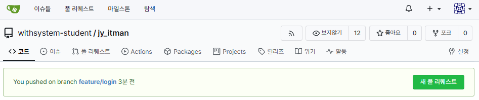
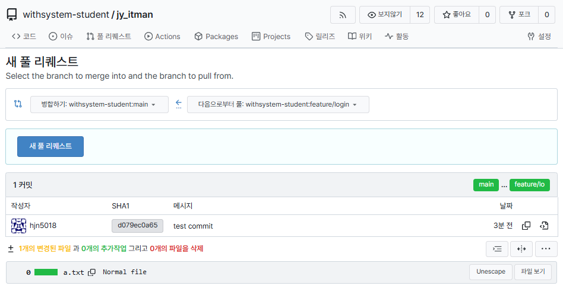
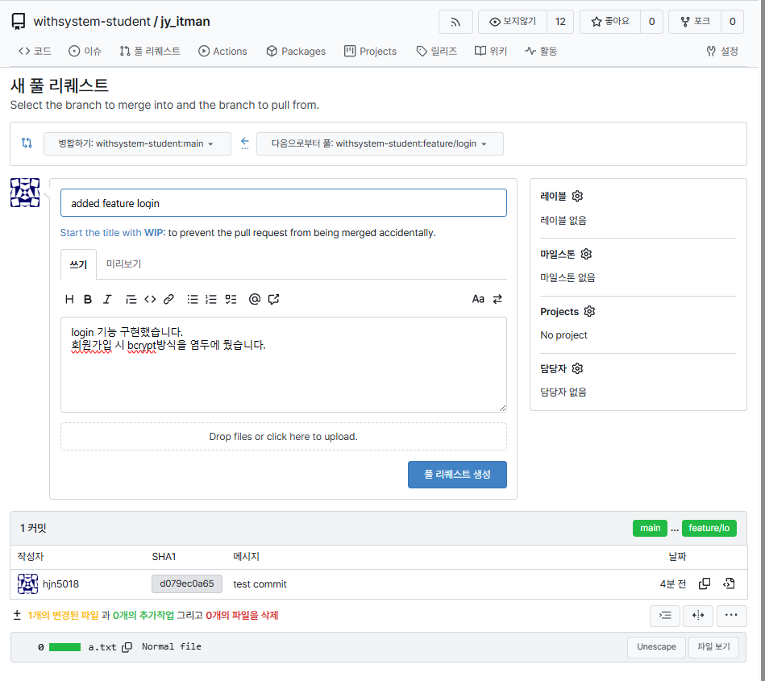
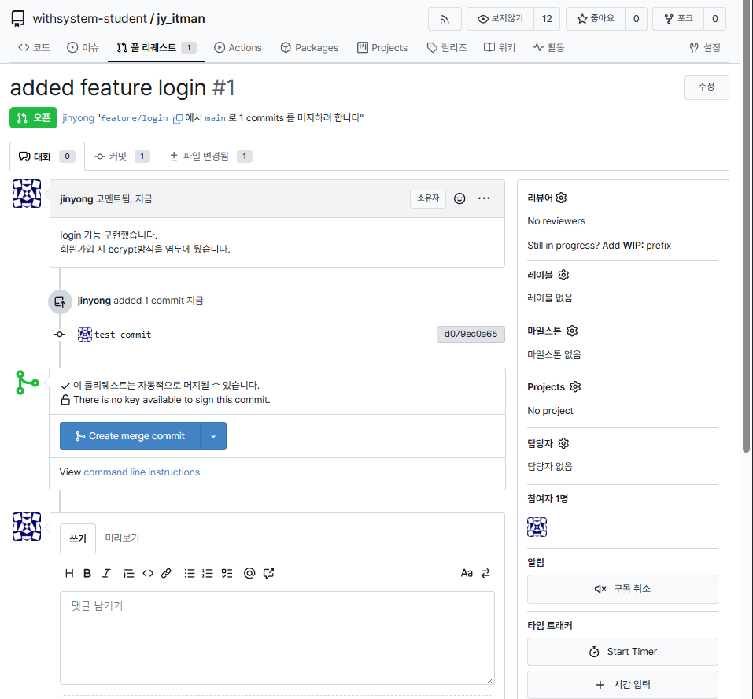
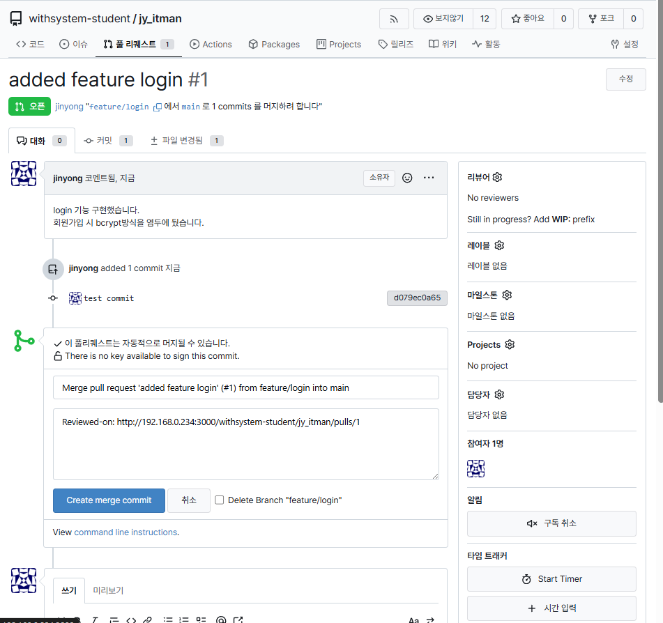
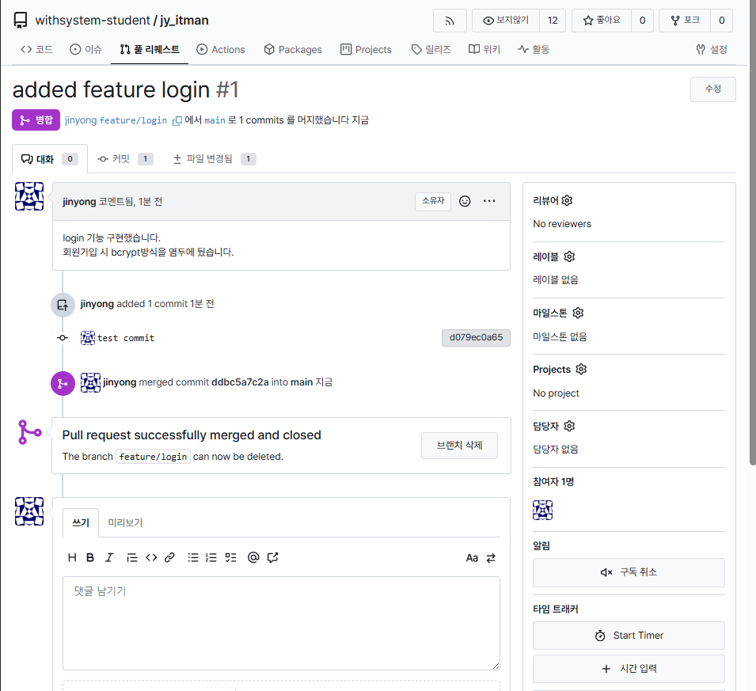

# DRINK

## 작업 준비
1. bash로 eclipse의 workspace에 들어간다. && DRINK 폴더를 생성한다.

2. DRINK 폴더로 들어간다 && 다음 명령어를 입력한다.

`git clone http://192.168.0.234:3000/withsystem-student/DRINK .`

3. eclipse를 들어간다.

4. File > Open Projects from File System에서 import source의 Directory를 workspace의 DRINK로 선택한다.

## 작업 방식
### 1. 작업 전 다음 명령어로 dev branch를 최신화하고, eclipse에서도 최신화한 뒤, branch를 생성한다.

`git switch dev`
`git pull origin dev`
`eclipse 최신화`
`git switch -c feature/<작업 명>`
> ex) `git switch -c feature/<login>`

### 2. 한 단위의 작업이 완성되면 커밋한다.

`git add .`

`git commit -m "<커밋 메세지>"`
> ex)
 `git add .`
 `git commit -m "added login feature"`

### 3. 모든 작업이 끝나면 다음 명령어로 push한다.

`git push origin <자신의 브랜치 명>`
> ex) `git push origin feature/login`

### 4. `http://192.168.0.234:3000/withsystem-student/DRINK`로 접속한다.

### 5. 새 풀 리퀘스트를 누른다.

### 6. 왼쪽의 branch를 dev로 설정하고, 새 풀 리퀘스트를 누른다.

### 7. dev 브랜치로 합치기 전, 요청 메시지를 입력한다.

### 8. 풀 리퀘스트를 생성한다.

### 9. 팀원에게 풀 리퀘스트를 생성했음을 알린다.

### 10. 팀원의 리뷰하에 Create merge commit -> (메시지 작성) -> Create merge commit을 거쳐 dev로 merge한다.

### 11. `dev` 브랜치에 병합된 후, 다음 작업을 시작하기 전에 로컬 및 원격 브랜치를 정리합니다.
    a. `dev` 브랜치로 이동하여 최신 변경 사항을 가져옵니다.
       `git switch dev`
       `git pull origin dev`
    b. 로컬 feature 브랜치를 삭제합니다.
       `git branch -d feature/<작업 명>`
       > ex) `git branch -d feature/logout`
    c. 원격 feature 브랜치를 삭제합니다.
       `git push origin --delete feature/<작업 명>`
       > ex) `git push origin --delete feature/logout`

### 12. 새로운 작업을 시작할 때는 다시 `git switch -c feature/<새로운 작업 명>` 명령어를 사용하여 새 브랜치를 생성합니다.
